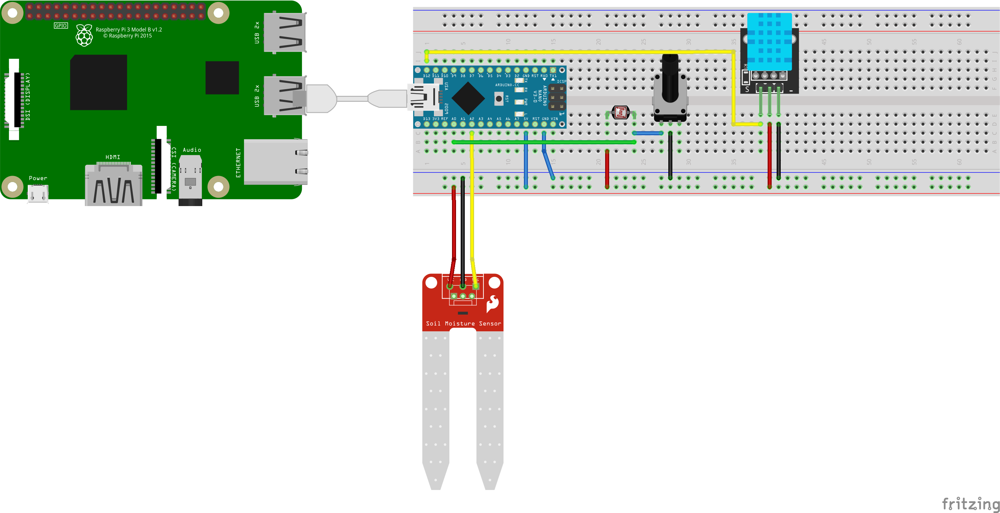

# Cumulocity Plant Demo
A demo project to integrate representative sensors for a plant to Cumulocity platform, either in realtime or with batch proccessing when the Internet connection is re-established.
## Microcontroller
### Setup
An Arduino Uno/Nano can be used with a DHT11 -or some similar digital temperature sensor- on pin D12,  LDR connected to pin A0 and the soil humidity sensor to pin A2 with a pull-up resistor or a potentiometer in between both their respective ground connections-close to 10k Ohms would be appropriate-. Here is a circuit diagram on a breadboard:

Download DHT Library by Adafruit for Arduino from the Library Manager of Arduino IDE, connect the Arduino to your computer and upload the sketch in the microcontroller folder with Arduino IDE. Connect it to the agent via USB or any serial-capable connection, and edit the agent's device.py-line 6  to use the appropriate port:

Line 6:
```
ser = serial.Serial('/dev/ttyUSB0', 9600) #initiate serial connection-edit the ttyUSBxx to correct port (default for RPi)
```
You can get its connected serial port by executing the following command before and after the connection:
```
ls /dev/tty*
```
Any added line between executions will represent the connected serial port for the microcontroller.
### Communication
Any data "packet" that is sent by the microcontroller will look like this:
```
s~lightAnalog~soilHumidityAnalog~temperature~humidity~
.checksumAnalog.checksumDigital.
```
where "s" denotes the start of the transmission, "~" is the delimiter between sensor data, "." is the start and delimiter of checksums (simple xor of values) for lightAnalog (0-1023) and soidHumidityAnalog (1023-0), then temperature (digital, no conversion Celsius) and humidity (digital, direct percentages) respectively. With values differing in magnitude in analog and digital readings it was easier and more accurate to use and check seperate checksums for their values.
```
checksumAnalog=lightAnalog^soilHumidityAnalog
checksumDigital=temperature^humidity
```
Any failure in the transmission of the data "packet" -a bit flip, unstable connection etc.- will be caught by the agent, and will not be sent to Cumulocity. You can monitor the transmission by connecting the microcontroller to any serial monitor -e.g. your computer- to see whether the data sent is correct and sensor readings are in order.
## Agent
### Setup
Clone the repository, edit wMioConfig file with webMethods.io workflow webhook parameters and a unique device name, edit the agent.py as described in Microcontroller Setup section if needed, edit the URL in checkConnection.py to your tenant's URL and run the script start.sh on the same directory after editing the service user "pi" if required. The systemd services ifdeviceconnector.service -serial connection- and ifdeviceagent.service -data agent- will already be configured and enabled to get them started at every startup. The light will blink green whenever a transmission is tried on the agent side to Cumulocity.

As the device targeted is a Raspberry Pi, user pi is the owner of the services, so make sure that user is a sudoer and requires no password for sudo, or change the User parts in start.sh.
### Configuration
Although they can also be calibrated with the potentiometer connected to analog sensors, one can also change the interval and values of the converted sensor data to Cumulocity in the convertLight and convertHumid blocks of the agent.py. The algorithm is pretty self-explanatory, but keep in mind that they are percentages -not necessarily, but the default is this-, and soil humidity sensor will output 1023 as plain dry, and 0 as it gets more moist, which is inverse to the light where 1023 is the brighest.
Additionally, you can edit the variable timeInterval (*default 5s*) in device.py to determine the interval between two measurements stored -to be sent to Cumulocity afterwards- when there exists no Internet connection, and the interval it checks whether there is an Internet connection or not (time interval for this is *2 timeIntervals*)
## Troubleshooting
Make sure you followed the setup fully. The first step with any problem, is actually unplug every connection to the agent, and plug it back in. With the restart, everything should be reinitialized which solves %90 of the problems:)
### No data is sent to Cumulocity
#### No blink -light is solid or gone-
The agent device probably doesn't have the connection to the Internet, or the checkConnection.py's reference URL isn't changed to your tenant's URL. Make sure it does. If it does, then a failure repeated too many times. Have it restarted -plug unplug will work-. If it still does not work, follow service troubleshooting and microcontroller troubleshooting steps.

After some time without the Internet access for the agent, the data collected but not sent yet gets big in size, and takes some time to upload to Cumulocity. In this case, after the connection is established again, the agent's LED will change state once, and after the entire data is sent, will start blinking again. So, if there happens to be only one blink and rest, wait some time -it can take up to a minute per day not connected- before trying to make it connect again, since it can be already connected. TLDR, make sure actually no blink was there. 
#### Blink, but no data sent
Take a look at the agent directory. If you notice files with .m or .temp extensions are created, try to look at their contents to check if they fit to the format in the Communication section -without the starting symbol "s"- , and the checksums are correct. If it does not comply, try the microcontroller troubleshooting steps. If it does, run the following:
```
sudo tedge mqtt sub tedge/errors
```
This will show any transmission errors with Cumulocity's MQTT service. If there is any, there is probably a misconfiguration of thin-edge.io. Try to run start.sh again, or follow the troubleshooting steps on thin-edge.io's guide.
If there are no files with .m or .temp being created and deleted, check service troubleshooting steps with the emphasis on ifdevicecontroller service.
### Data sent to Cumulocity is inaccurate
Follow microcontroller troubleshooting steps. Make sure you calibrated the analog sensors as you like, and edited the conversion block of agent.py correctly if you have done so. If no fault there, and the values are exactly as you expect, try to get the measurements with deviceID from Cumulocity's REST API to see if you can spot the problem.
### Microcontroller Troubleshooting
#### Sensors
First, make sure the RX or TX LED of Arduino blinks steadily multiple times per second. If that is not the case, reuploading the sketch to the Arduino may be required. Otherwise, connect the Arduino to your computer and open up Serial Monitor with baud rate 9600 to monitor the data. Here is a sample:
```
s~894-261-26-52~
.635.46.
```
Try to manipulate the sensors to monitor the change better. Anything below 10 or above 1020 for the analog sensors or weird values -or 0- for the digital sensors with no significant change reflected from environmental changes means a sensor is either faulty or misconnected.

#### Agent Connection
There can be a faulty or misconfigured serial connection between agent and the microcontroller. This can be seen in detail with service status calls described in service troubleshooting section. The most common will be: 
```
serial.serialutil.SerialException: [Errno 2] could not open port /dev/ttyUSB0: [Errno 2] No such file or directory: '/dev/ttyUSB0'
```
With this case, repeat the steps described in Microcontroller Setup section about serial ports.

If the program raises a:
```
ConnectionError: Unreliable serial communication: Number of failed transmissions exceeded threshold
```
Cycle the connection to the microcontroller and restart either the service or the agent itself and hope it fixes itself:) If it does not, it is probably a faulty cable or microcontroller altogether. Try the Sensors troubleshooting to see if you can get any data.
### Service Troubleshooting
Since the services are configured to restart multiple times to a faultless state after a failure, it may be hard to see the error. To overcome this problem, run 
```
sudo systemctl status ifdeviceagent.service
sudo systemctl status ifdeviceconnector.service
```
multiple times to catch the exceptions. You can also use journalctl which would be easier, but logging is not complete with this project, so with device agent, LED switch generates loads of logs that makes errors hard to find.

The errors are pretty verbose in their context (you can check the code and comments for further explanation), but generally a problem in connector service should make you look into microservice troubleshooting-agent connection section, and agent service to OS related errors (file reads, IOErrors, out of disk space, things that are generally fixed with restarts or reinstalls). 
As a deficiency of the use of os.system() in the program, permission errors probably will not be verbose, so make sure the service user complies with Agent setup section's requirements and the start.sh script is modified accordingly.
